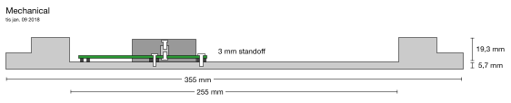

## Clock Board



## Revisions

Board revisions are kept as tags in git. The board is generally tagged when the files have been sent off for manufacturing. To export a specific revision, simply run

```
$ git archive --format zip -o /path/to/rev-a.zip 4d268f
```

where the hash of the tag can be found by running `git show rev-a` for the specific tag.
